[Evolution Strategies at Scale: LLM Fine-Tuning Beyond Reinforcement Learning](https://arxiv.org/abs/2509.24372) was quite the read.

A bit of background:

In 2017, OpenAI released "[Evolution strategies as a scalable alternative to reinforcement learning](https://openai.com/index/evolution-strategies/)". It demonstrated that with population sizes in the hundreds or thousands, the ES optimizer can match RL baselines. Importantly, ES requires only forward passes for evaluations, whereas standard RL needs a backward pass to compute the gradients.

The ES algorithm itself is very simple, generally following these steps:

1. Sample some noise under a specified seed and add it to the model. This process is called perturbation.
2. Assess how well the model performs with that added noise. This is its reward value.
3. Save the seed and the reward value.
4. Revert the model back to the baseline by subtracting the noise.
5. Repeat steps 1-4 ``N`` times (N is the population size).
6. Sum up all your noises multiplied by their reward values (so "good" noise gets a high weight and vice versa). This is your approximated gradient, though it hardly resembles a real gradient.
7. Add your gradient to the model, or run it through an optimizer if desired.
8. Repeat steps 1-7 until convergence

There are many ways this algorithm is subtly modified, such as by subtracting the noise mean or by dividing by the standard deviation. None of these changes how it fundamentally works, and can be thought of as variations on the reward function.

For reference, the ES hyperparameters are:
- sigma (σ): controls how big the noise that gets added to the model is. I also refer to this as the perturbation scale, or standard deviation (of the noise).
- population size (N): how many seeds you evaluate before summing to form the gradient.
- alpha (α): your learning rate. It multiplies the gradient, which is also divided by the sigma (in OpenAI's algorithm) and the population size.

*There might also be a batch size or rollout length to tune, depending on your RL environment.*

While it's great that we can train a model without doing any backward passes, its still not practical to train LLMs if it takes hundreds or thousands of evaluations every step.

Going back to [Evolution Strategies at Scale: LLM Fine-Tuning Beyond Reinforcement Learning](https://arxiv.org/abs/2509.24372), they claim they could get Qwen2.5 to be competitive against GRPO using ES with only a population of 30.

This still seems ridiculous. The dimensionality of an LLM is in the tens of thousands (meaning there could be hundreds of thousands of random noises to sample). The possibility of sampling 30 random noises and getting a good result should be impossible. In fact, such a process should be akin to a random walk, which would degrade the model.

Nonetheless, I set out to replicate it. Luckily, their [repository](https://github.com/VsonicV/es-fine-tuning-paper) is open source. I cleaned it up a bit (to make this repository) and began training.

Surprise! It converged:

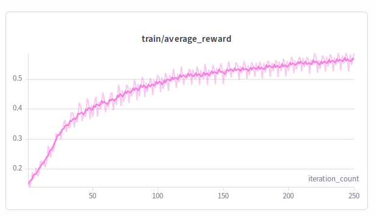

And it was basically a 1:1 of their results. Furthermore, despite changing the hyperparameters and running it several more times, it was extremely consistent. It would always converge, and with stable training dynamics. 

Conclusion: luck is irrelevant, this algorithm is just good.

In any case, since the algorithm worked, there was a lot to do. Namely, getting LoRA working.

To clear up some confusion regarding LoRA, it is important to be aware of two things:
1. LoRA does not yield any memory reduction here, because ES has no backward pass, and no optimizer state. The gradient is also computed on the fly, so there is no need for checkpointing.
2. [Eggroll](https://arxiv.org/abs/2511.16652) is not really ES with LoRA in the sense that you would expect; it approximates the high rank update with low rank perturbations, which is not the same as doing the updates in a low rank space. Strictly speaking, Eggroll's update method is superior.

The reason you want LoRA is that vLLM has punica kernels, which accelerate batched lora inference. Normally, with ES, you must evaluate one member of the population at a time, and then revert the noise and add the next noise. With LoRA, you can do everything in parallel on top of optimized kernels. This is also a reason to *not* implement Eggroll, as Eggroll interfaces poorly with the vLLM backend.

Unfortunately, getting LoRA to work is an absolute ***pain***. There's a lengthy discussion on it [here](https://github.com/VsonicV/es-fine-tuning-paper/discussions/11), but to summarize:
1. vLLM holds copies of the LoRA adapters in multiple places and swaps them between CPU and GPU. If you add the noise to the wrong adapter (ie, the one on the CPU), nothing will happen. Worst of all, if you don't specify ``max_loras``, vLLM may evict your trained LoRA. Reference [lora_manager](https://docs.vllm.ai/en/stable/api/vllm/lora/worker_manager.html) and [adapter_manager](https://docs.vllm.ai/en/stable/api/vllm/lora/models.html#vllm.lora.models.LoRAModelManager). In particular, ``adapter_manager.lora_index_to_id`` and ``adapter_manager.modules.items()`` will be useful, but avoid ``adapter_manager.list_adapters()``.
2. There is a small amount of noise when perturbing both LoRA A and LoRA B simultaneously, because the expansion ``(A + noise_1 + noise_2 ...)(B + noise_1 + noise_2 ...)`` works out with some extra cross-terms between the noises. You may want to attempt perturbing only one adapter at a time.
3. Since your LoRA is AB, perturbing A by some value actually increases the result by a multiple of B. Thus, over time, the LoRAs tend to exponentially grow, and the model explodes. You want to normalize the perturbation and update sizes by the norm of the LoRA.

With one or more of the three patches above, you will go from something that is completely broken to a functional LoRA trainer! And it seems just as good as the normal ES trainer:

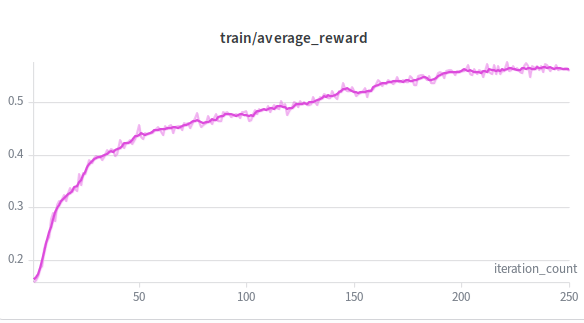

In many regimes, LoRA beats out the baseline, as it yields better compute utilization at the cost of small overheads. More testing will need to be done to determine exactly how the rank affects training, independent of everything else.

As a last aside, the exact ES update rule that OpenAI proposes is unhelpful. They suggest dividing your step size (effective LR) by sigma, but consider this:
1. You have a model that is hyper-sensitive to changes. 
2. You add some noise, and find the model explodes, so you decrease sigma to compensate. 
3. By decreasing sigma, your effective LR is now bigger, so your model explodes (again).
4. Now you must tune alpha as well, even if its value was perfectly fine.

Sigma is a direct proxy for how "sensitive" the model is to the noise. I believe that your step size should be proportional to the sensitivity, and thus be multiplied by sigma.

Mathematically, in natural gradient descent, you want to multiply your step by the inverse Fisher matrix, which turns out to be sigma squared. Canceling one of the sigmas with the denominator gives you an equation that is exactly proportional to sigma.

I also have some empirical evidence to justify this, but I'll leave it to you to experiment. In any case, it's just a hyperparameter, so it doesn't change anything.

### Update:

I swept substantially more configurations with Optuna, and implemented a bunch of various modifications to see what works. LoRA (pop=56, bsz=100) and Non-LoRA (pop=28, bsz=200) were swept out separately with the same amount of data seen per step. In this case, LoRA generally performed a bit better.

There was a massive amount of dead space where runs would simply explode, and I didn't quite finish the hyperparameter sweep, so the results should be taken with a grain of salt. In any case, however, we can extract some decent baselines from this.

First of all, while I attempted to implement a way to automatically set the value for the perturbation scale/sigma, the model performance seemed almost entirely dominated by stochastic noise:

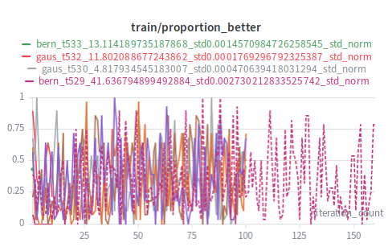

so that idea is scrapped.

Both the non-lora sweep:

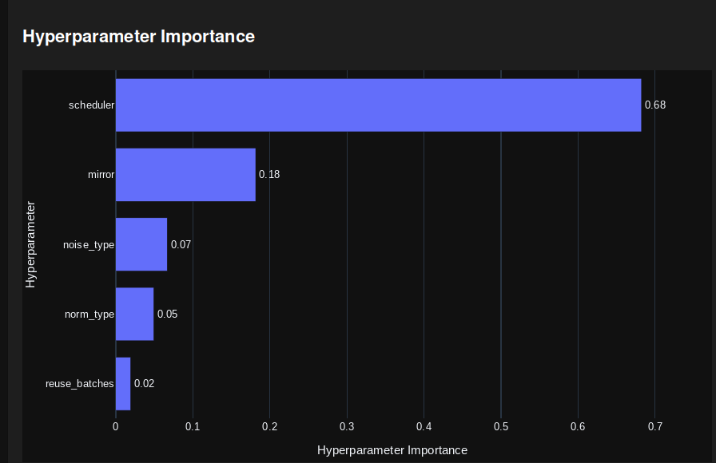

and the lora sweep:

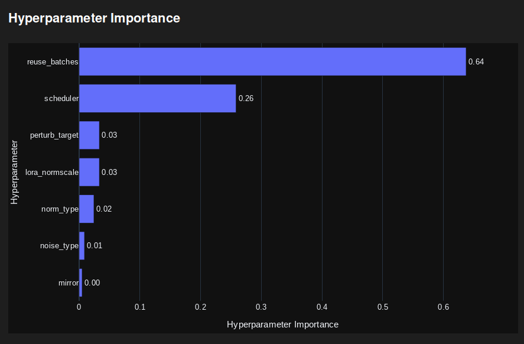

insist the scheduler is quite important:

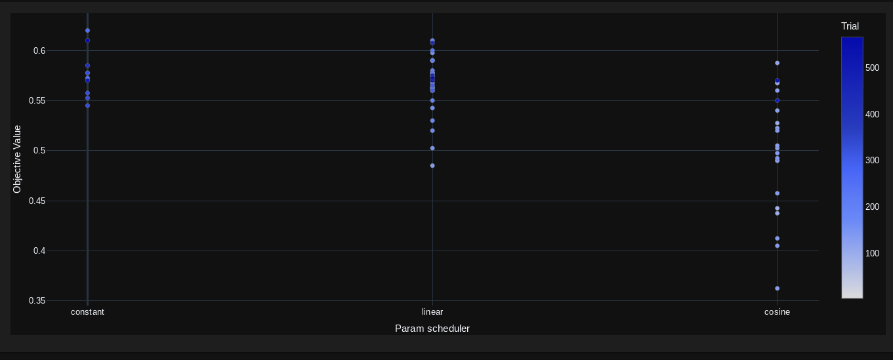

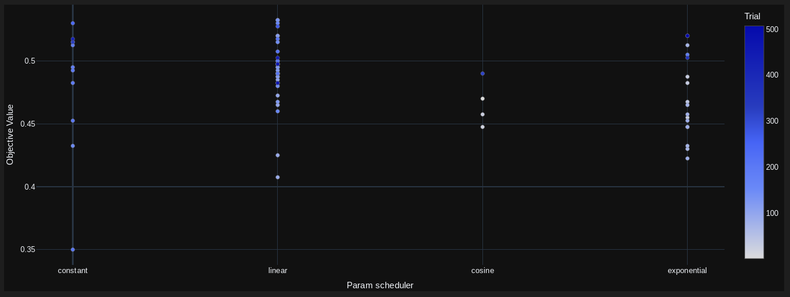

this could just be noise, though.

Forcing each population member to use a different batch (inspired by Eggroll) seems to massively help with the LoRA setup, but not so much the Non-LoRA setup, presumably due to having a higher batch size in the first place:

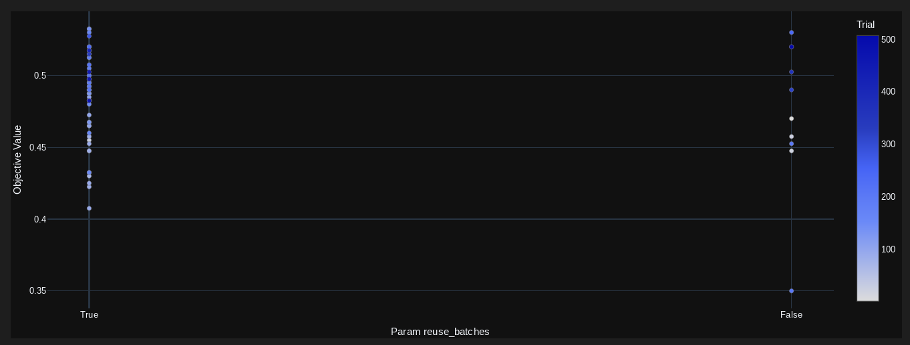

For some reason, the sampler was allergic to std-norm and only ever sampled rank-norm, but we can guess what the optimal LR range is:

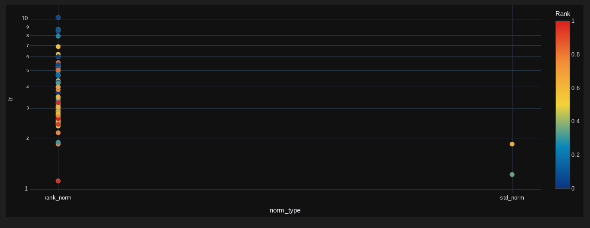

(lora)

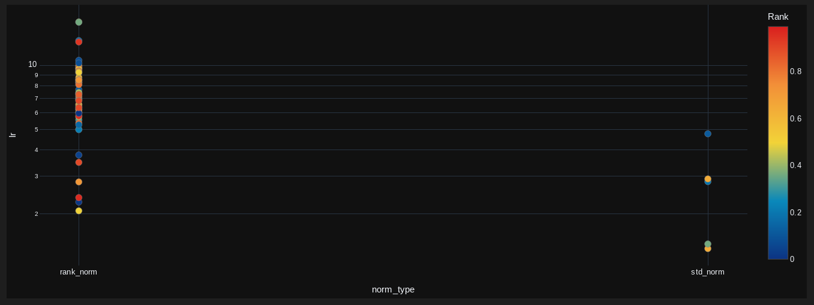

(non-lora)

Optimal sigma value, for reference:

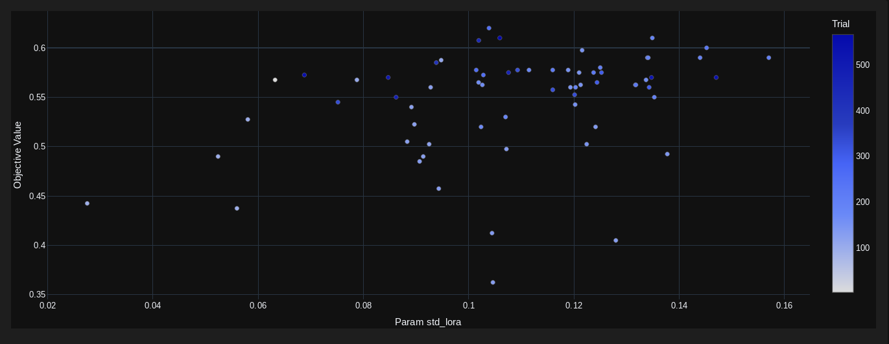

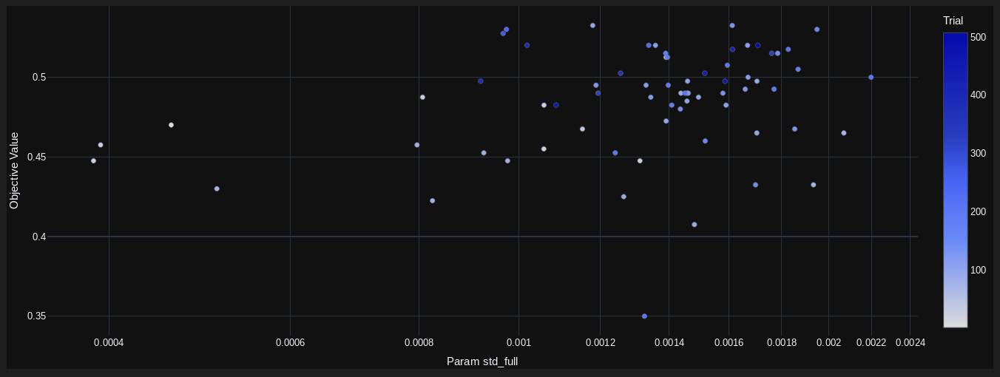

Considering that the LR range was roughly overlapping between LoRA and non-LoRA, but the sigma differed by a magnitude, it's fair to say that multiplying by sigma was the correct choice.

What didn't matter: the noise type (bernoulli vs gaussian), whether or not mirroring was used. 

I'm unsure what impact scaling the update by the LoRA norm has, or what impact only perturbing one LoRA adapter at a time has. It's also uncertain if rank normalization is better than std normalization, or if its more stable over a wider range of learning rates, or if replacing the empirical mean with the actual mean (centered eval) helps. However, I wouldn't expect a massive difference, or Optuna probably would've found it. After all, I did train for a combined 1500 runs or so.

If anyone has substantial amounts of compute lying around, it'd be great if you could trial the remaining hyperparameters.